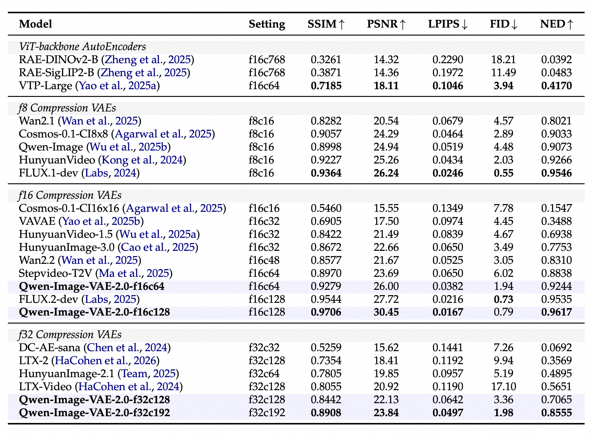

# OmniDoc-TokenBench

Technical report and dataset are coming soon.

---

## Introduction

**OmniDoc-TokenBench** is a curated benchmark of ~3K text-rich document images for evaluating VAE reconstruction on textual content, alongside an evaluation toolkit supporting PSNR, SSIM, LPIPS, FID, and OCR-based NED metrics. It spans nine categories (*book*, *slides*, *color textbook*, *exam paper*, *academic paper*, *magazine*, *financial report*, *newspaper*, *note*) in both English and Chinese.

<p align="center">
  
<p>

Derived from OmniDocBench, each sample is cropped from a text block and resized to 256x256 with reference character sizes of 16px (Chinese) and 10px (English). We filter for sufficient character density ([200, 600] for Chinese, [300, 600] for English), deduplicate via n-gram overlap, and manually inspect for quality.

**Evaluation.** Beyond standard traditional metrics (PSNR, SSIM, LPIPS, FID), we use **NED** (Normalized Edit Distance) as the primary text-fidelity metric. NED compares the OCR outputs of the original and reconstructed images using Levenshtein distance:

$$
\mathrm{NED} = \frac{1}{N}\sum_{i=1}^{N}\left(1 - \frac{d_{\mathrm{edit}}(s_{\mathrm{gt}}^{(i)}, s_{\mathrm{recon}}^{(i)})}{\max(|s_{\mathrm{gt}}^{(i)}|, |s_{\mathrm{recon}}^{(i)}|)}\right)
$$

---

## Results

We conduct a comprehensive evaluation on OmniDoc-TokenBench (~3K text-rich images, 256×256). Models are grouped by spatial compression factor and sorted by NED within each group.

<p align="center">
  
<p>

---

## Evaluation

### Installation

```bash
pip install torch torchvision piq lpips pytorch-fid pillow numpy tqdm
pip install paddleocr python-Levenshtein  # required for NED
```

### Usage

Place your ground-truth images in `gt_dir/` and reconstructed images in `recon_dir/` (filenames must match one-to-one).

```bash
# Compute NED only (default)
python eval_metrics.py --gt_dir ./gt_dir --recon_dir ./recon_dir

# Compute traditional metrics (PSNR / SSIM / LPIPS / FID)
python eval_metrics.py --gt_dir ./gt_dir --recon_dir ./recon_dir --mode pixel

# Compute all metrics
python eval_metrics.py --gt_dir ./gt_dir --recon_dir ./recon_dir --mode all

# Specify output directory and device
python eval_metrics.py --gt_dir ./gt_dir --recon_dir ./recon_dir --save_path ./results --device cuda
```

### Output

The script writes results to the `--save_path` directory (default: `./eval_results`):

- `results.json` --- Aggregated metrics (example):
  ```json
  {
    "num_samples": 100,
    "PSNR": 30.45,
    "SSIM": 0.9706,
    "LPIPS": 0.0523,
    "FID": 1.98,
    "NED": 0.9617,
    "NED_samples": 98
  }
  ```

- `ned_details.json` --- Per-image OCR results and NED scores (generated when `--mode` is `ned` or `all`):
  ```json
  {
    "avg_ned": 0.9617,
    "total_samples": 100,
    "valid_samples": 98,
    "details": [
      {
        "file": "0001.png",
        "gt_ocr": "The quick brown fox...",
        "recon_ocr": "The quick brown fox...",
        "ned": 0.9764
      }
    ]
  }
  ```

### Notes

- `FID` and `LPIPS` require downloading model checkpoints on the first run (InceptionV3 ~90MB for FID, VGG16 ~530MB for LPIPS). Ensure network access or pre-download the weight files.
- PaddleOCR defaults to CPU inference. For large-scale evaluation, consider switching to GPU by setting `device="gpu"` in `compute_ned()`.
- The progress bar for PSNR/SSIM/LPIPS displays running means in real time.

---

## Citation

If you use OmniDoc-TokenBench or this evaluation toolkit in your research, please cite:

```bibtex
% TODO
```

---

## License

- OmniDoc-TokenBench is a derivative dataset based on [OmniDocBench](https://github.com/opendatalab/OmniDocBench), developed by the Qwen Team at Alibaba Group.

- This project is licensed under the [Apache License 2.0](LICENSE).
